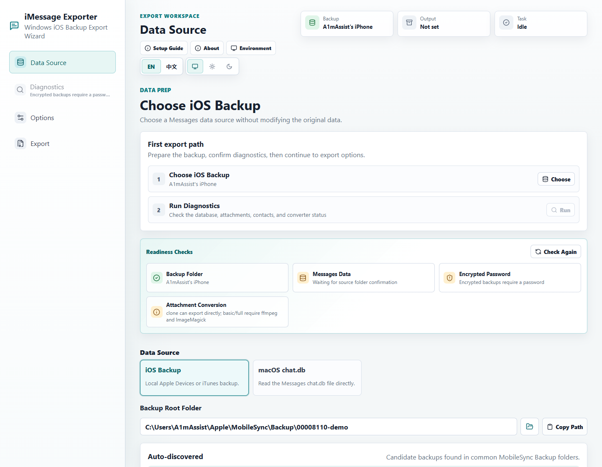
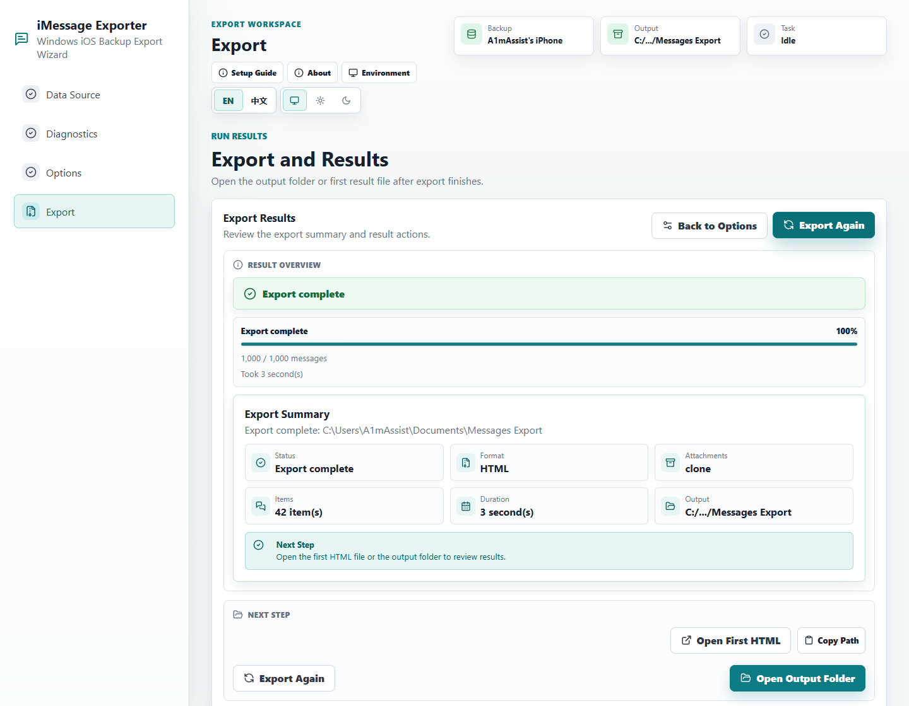

# iMessage Exporter GUI

[中文说明](./README.zh-CN.md)

`iMessage Exporter GUI` is a desktop app for exporting Messages data with the
[`imessage-exporter`](https://github.com/ReagentX/imessage-exporter) Rust engine
built in. The installer bundles the imessage-exporter Rust engine, so it can
export SMS and iMessage data from a local iOS backup or a macOS `chat.db` file
to HTML, TXT, or JSONL.

The app turns the export flow into a guided workspace: choose a data source, run
diagnostics, review export options, start the export, and open the result folder.
Users do not need to install Rust, Node.js, Visual Studio Build Tools, or a
separate `imessage-exporter.exe`.

## Screenshots





The `example-*` images are README screenshots. `react-mock-*` images are
generated by the mock UI smoke test and are kept as release QA artifacts.

## Download

Download the current installer from GitHub Releases:

[Download the current release](https://github.com/A1mAssist/imessage-exporter-gui/releases/latest)

Choose the file for your system:

- Windows: download the `.exe` installer for the recommended normal install.
- Windows managed deployment: use the `.msi` when your deployment tooling expects MSI packages.
- macOS Apple Silicon or Intel: download the `.dmg`.

The installers are not code-signed yet, so your system may show a safety warning:

- Windows SmartScreen: click "More info", then "Run anyway".
- macOS Gatekeeper: right-click the app and choose "Open", or allow it in System Settings -> Privacy & Security.

Installed builds can Check for updates from the About dialog. Update packages
are verified by the app updater signature, but the installers themselves are
still unsigned.

## Basic Use

1. Create a local iPhone or iPad backup with Apple Devices or iTunes, or locate a macOS Messages `chat.db`.
2. Open iMessage Exporter GUI.
3. In Data Source, choose an iOS backup folder or a macOS `chat.db` file.
4. If the iOS backup is encrypted, enter the backup password.
5. Run diagnostics to check the database, contacts, attachments, and optional converters.
6. Choose the export format, attachment strategy, date range, conversation filter, naming mode, and output folder.
7. Start the export, then open the output folder or the first result file when it completes.

Common data locations:

```txt
Windows iOS backups: %APPDATA%\Apple Computer\MobileSync\Backup
macOS iOS backups: ~/Library/Application Support/MobileSync/Backup
macOS Messages database: ~/Library/Messages/chat.db
```

For a copied macOS `chat.db`, you can optionally point the app at the matching
Messages attachment folder and AddressBook database so HTML exports and contact
names are more complete.

## What It Does

- Guided English and Chinese UI with light, dark, and system theme modes.
- Local iOS backup scanning plus manual source selection.
- macOS `chat.db` source support with optional attachment root and contacts database paths.
- Built-in `imessage-exporter` engine for diagnostics and exports.
- HTML, TXT, and JSONL exports.
- HTML attachment modes: disabled, clone, basic, and full. TXT and JSONL always skip attachment files.
- Conversation picker that merges the same contact across multiple caller IDs and exports records in time order.
- Filename modes: contact name, contact name + caller ID, or raw caller ID.
- Timestamped archive folder generation, with a privacy mode that avoids contact names in folder names.
- Per-conversation HTML output folders that keep each HTML file with its matching attachments.
- Export progress with exact message counts, elapsed time, and estimated remaining time.
- Interrupted `.partial` export detection, safe cleanup, and resume support when the checkpoint matches the same export settings.
- JSONL result quick search after a successful JSONL export.
- Diagnostic reports that can be copied or downloaded as `.txt`.
- Output folder checks to avoid writing into the data source folder or mixing with old exports by accident.
- About and Environment dialogs with app version, engine status, updater status, dependency checks, and a copyable support snapshot.
- Close-to-tray behavior; the tray menu can show the app again or quit when no task is active.

## Privacy And Safety

- Backup passwords are kept only in app memory and are not saved to local settings.
- Visible command previews and raw engine logs are not shown in the UI.
- Diagnostic reports and recovery hints redact sensitive values.
- The built-in Rust engine receives the password only for the current task.
- Export output cannot be placed inside the selected data source.
- Current installers are unsigned and intended for small-scale testing.

## Current Limits

- Windows and macOS are the supported installer targets.
- Linux builds are not published.
- iCloud-only Messages that are not present in the local backup/database cannot be exported.
- `ffmpeg` and ImageMagick are not bundled; they are only needed for basic/full attachment conversion.
- Native PDF export is not available yet; export HTML first, then print to PDF from a browser.
- Windows and macOS builds are not code-signed yet.

## Development Verification

```powershell
npm run check:static
npm test
npm run build
Push-Location src-tauri
cargo test
cargo check
Pop-Location
```

The Rust tests cover the built-in exporter option builders and backend export
paths, including JSONL and TXT attachment disabling. The mock UI smoke test
regenerates `react-mock-*` QA screenshots.

## License

GPL-3.0-only. See [LICENSE](./LICENSE) and
[THIRD_PARTY_NOTICES.md](./THIRD_PARTY_NOTICES.md).
