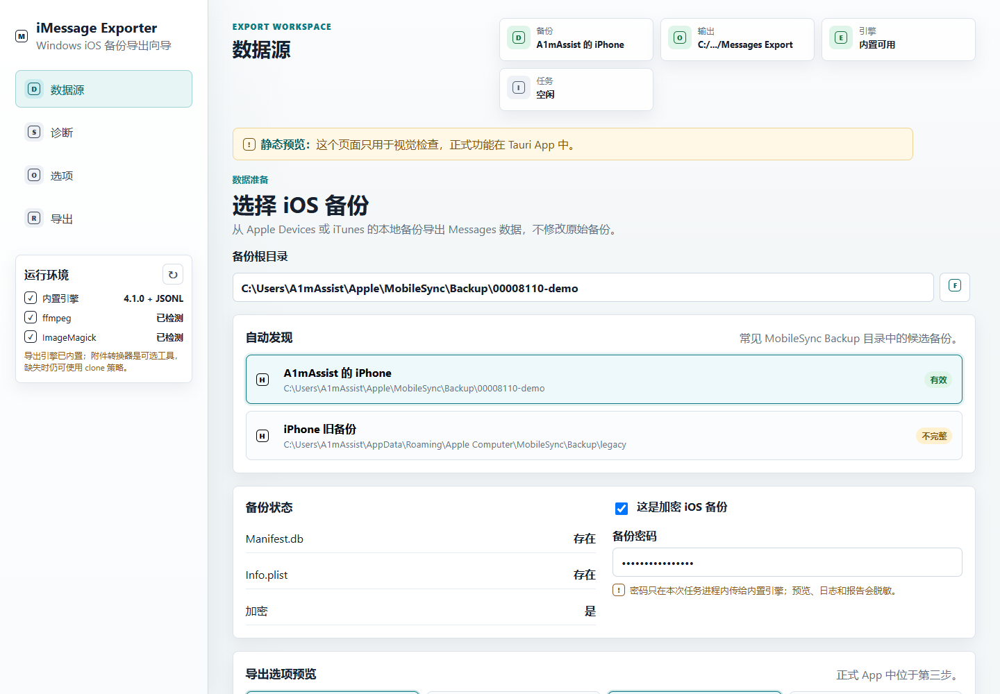

# iMessage Exporter GUI

`iMessage Exporter GUI` 是 [`imessage-exporter`](https://github.com/ReagentX/imessage-exporter) 的桌面图形界面，用来把本机 iOS 备份里的短信/iMessage 导出为 HTML 或 TXT。

这个项目使用 Tauri v2、React 和 TypeScript 构建。当前 v1 目标是让普通用户不用手写命令：选择 iOS 备份、运行诊断、配置导出选项、查看日志、取消长任务，并打开导出结果目录。

## 下载安装

普通用户不需要拉取源码，也不需要安装 Node.js、Rust 或 Visual Studio Build Tools。直接从 GitHub Releases 下载安装包即可：

[下载最新版](https://github.com/A1mAssist/imessage-exporter-gui/releases/latest)

按系统选择文件：

- Windows：下载 `.exe` 或 `.msi` 安装包。
- macOS：下载 `.dmg`。
- Linux：下载 `.AppImage` 或 `.deb`。

当前安装包还没有代码签名，所以系统可能会弹出安全提示：

- Windows SmartScreen：点击“更多信息”，然后选择“仍要运行”。
- macOS Gatekeeper：如果提示无法打开，可以右键 App 选择“打开”，或到“系统设置 -> 隐私与安全性”允许打开。
- Linux：如果 `.AppImage` 不能启动，先给它执行权限，例如 `chmod +x iMessage*.AppImage`。

## 基本使用

1. 用 Apple Devices 或 iTunes 在本机创建 iPhone/iPad 备份。
2. 打开 iMessage Exporter GUI。
3. 在“数据源”步骤选择或扫描本机 iOS 备份目录。
4. 如果备份已加密，输入备份密码。
5. 运行诊断，确认数据库、附件和可选转换工具状态。
6. 选择导出格式、附件策略、日期范围和输出目录。
7. 开始导出，等待完成后打开输出目录或第一个结果文件。

常见备份位置：

```txt
Windows: %APPDATA%\Apple Computer\MobileSync\Backup
macOS: ~/Library/Application Support/MobileSync/Backup
```

## 功能状态

已实现：

- Windows、macOS、Linux 安装包由 GitHub Actions 自动构建。
- 中文向导式界面：数据源、诊断、导出选项、结果。
- 自动扫描本机 iOS 备份，也支持手动选择备份目录。
- 检查 `Manifest.db`、`Info.plist` 等备份关键文件。
- 调用随应用打包的 `imessage-exporter` sidecar。
- HTML/TXT 导出，支持附件复制策略、日期范围、会话筛选和显示名选项。
- 输出目录检查，避免误写入备份目录或旧导出目录。
- 一键生成带时间戳的导出目录，例如 `Messages Export 2026-06-12 0130`。
- 导出日志实时显示，支持搜索、stdout/stderr/error 过滤和取消任务。
- 诊断报告可复制或下载为 `.txt`。
- 密码不会写入本地设置；命令预览、日志和诊断报告会做脱敏。
- 识别常见失败原因：备份密码错误、备份不完整、输出目录权限不足、sidecar 缺失、转换工具缺失。
- 可选检测 `ffmpeg` 和 ImageMagick，用于部分附件转换模式。

当前限制：

- v1 只面向本机 iOS 备份导出。
- 暂不支持直接读取 macOS `chat.db`、越狱设备 `sms.db` 或独立附件目录。
- 暂不内置 `ffmpeg` 和 ImageMagick。
- 暂无原生 PDF 导出；可以先导出 HTML，再用浏览器打印为 PDF。
- 当前未做 Windows/macOS 代码签名，因此安装时可能有系统安全提示。

## 发布包说明

Release workflow 会为三个平台生成安装包：

- `imessage-exporter-gui-windows`：Windows NSIS `.exe` 和 MSI `.msi`。
- `imessage-exporter-gui-macos`：macOS `.dmg`。
- `imessage-exporter-gui-linux`：Linux `.deb` 和 `.AppImage`。

每个平台包里都包含对应系统的 `imessage-exporter` sidecar。用户安装后不需要单独构建 `imessage-exporter`。

创建正式 Release：

```powershell
git tag v0.1.0
git push origin v0.1.0
```

推送 `v*` tag 后，GitHub Actions 会运行 `Release Installers`，上传三平台安装包，并把安装包和校验文件附加到 GitHub Release。

也可以手动运行 Actions：

1. 打开仓库的 **Actions** 页面。
2. 选择 **Release Installers**。
3. 点击 **Run workflow**。
4. 运行结束后下载对应平台 artifact。

## 预览界面

仓库包含静态预览截图，方便不启动 Tauri 时查看界面：



本地打开静态预览：

```powershell
start chrome (Resolve-Path .\preview\index.html)
```

重新生成预览截图：

```powershell
.\scripts\render-preview.ps1
```

## 开发

本仓库保留 Windows 作为主要本地开发基线，因为本机 iOS 备份路径、Windows 安装包和现有辅助脚本在 Windows 上最完整。macOS 和 Linux 的发布构建由 GitHub Actions 覆盖。

开发依赖：

- Node.js 20+ 和 npm
- Rust stable 和 Cargo
- 目标系统的 Tauri 原生构建依赖
- Windows 本地原生构建需要 Visual Studio Build Tools 2022、Desktop development with C++ workload、Windows SDK 和 WebView2 Runtime
- Linux 本地原生构建需要 Tauri 使用的 WebKitGTK 和 AppIndicator 开发包
- macOS 本地原生构建需要 Xcode Command Line Tools

安装前端依赖：

```powershell
npm install
```

运行静态检查和测试：

```powershell
npm run verify
```

离线或受限环境可以跳过网络 audit：

```powershell
npm run verify:offline
```

单独运行常用检查：

```powershell
npm run check:static
npm test
npm audit
npm run smoke:mock-ui
```

如果 PowerShell 拦截 `npm.ps1`，可以显式调用 `npm.cmd`：

```powershell
npm.cmd run check:static
npm.cmd test
```

启动 Tauri 桌面开发模式：

```powershell
npm run tauri dev
```

启动浏览器 mock 模式：

```powershell
npm run dev:mock
```

mock 模式使用模拟备份、诊断、导出日志、取消、失败场景和空备份状态，适合在 sidecar 和 Tauri 环境准备好之前评审界面。

生产构建后用 mock 模式预览：

```powershell
npm run build
npm run serve:mock
```

然后打开：

```txt
http://127.0.0.1:4173/?mock=1
```

## Sidecar

GUI 会把 `imessage-exporter` 作为 Tauri sidecar 一起打包。当前锁定版本是 `4.1.0`，说明见 [SIDE_CAR.md](./SIDE_CAR.md)。

本地开发时可以构建 sidecar：

```powershell
.\scripts\build-sidecar.ps1
```

源代码阶段的 sidecar 文件名包含 Rust target triple，例如：

```txt
src-tauri\binaries\imessage-exporter-x86_64-pc-windows-msvc.exe
src-tauri/binaries/imessage-exporter-aarch64-apple-darwin
src-tauri/binaries/imessage-exporter-x86_64-unknown-linux-gnu
```

Tauri 打包时会把它复制成运行时资源：Windows 为 `imessage-exporter.exe`，macOS/Linux 为 `imessage-exporter`。

## 本地打包

推荐使用 GitHub Actions 构建发布包，因为本机不需要安装所有平台的工具链。

本地原生依赖和 sidecar 准备好后，也可以运行：

```powershell
npm run package:release
```

产物会复制到：

```txt
dist-release\
```

Windows 专用的旧打包快捷命令仍然保留：

```powershell
npm run package:windows
```

检查本地 Windows 开发环境：

```powershell
.\scripts\doctor.ps1
```

Windows 安装辅助脚本：

```powershell
.\scripts\setup-windows.ps1
.\scripts\setup-windows.ps1 -Install
```

包含可选附件转换工具：

```powershell
.\scripts\setup-windows.ps1 -Install -InstallOptionalTools
```

## 隐私与安全

- 加密备份密码只保存在应用运行状态里，不写入本地设置。
- 命令预览、日志和诊断报告会隐藏密码。
- 由于 upstream CLI 使用 `--cleartext-password` 参数，任务运行时密码仍可能短暂出现在系统进程列表里。
- 导出目录不能是备份目录本身，也不能位于备份目录内部。
- 发布包当前未签名，适合作为小范围测试版分发。

## 许可证

GPL-3.0-only。见 [LICENSE](./LICENSE) 和 [THIRD_PARTY_NOTICES.md](./THIRD_PARTY_NOTICES.md)。
