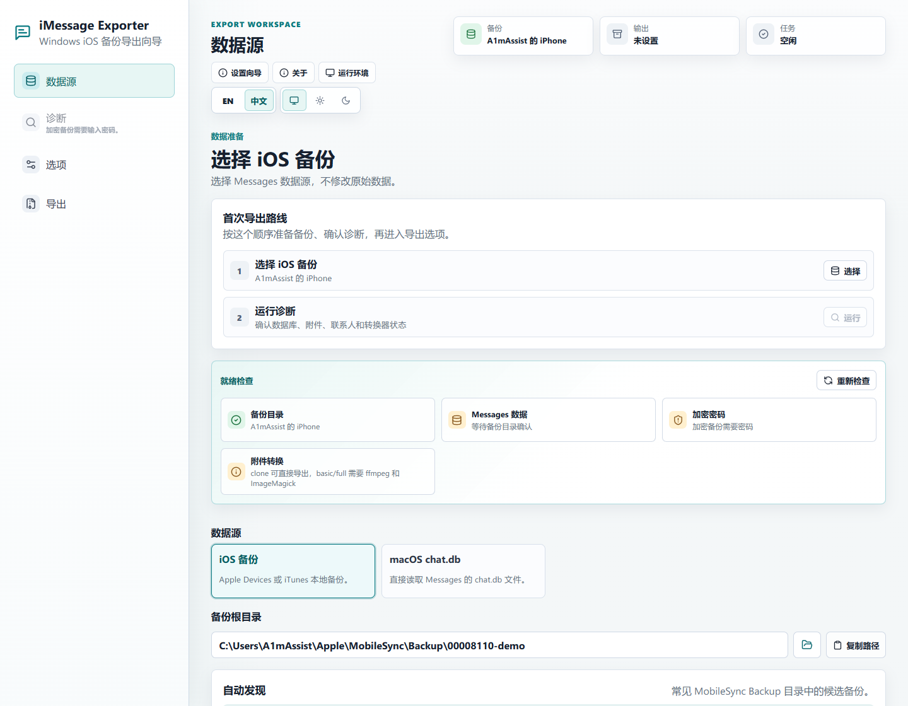
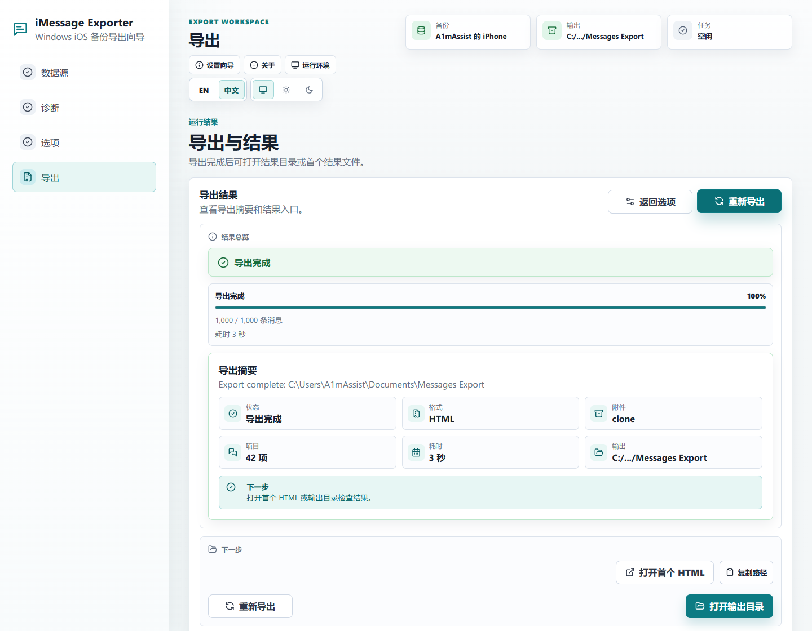

# iMessage Exporter GUI

[English](./README.md)

`iMessage Exporter GUI` 是内置
[`imessage-exporter`](https://github.com/ReagentX/imessage-exporter) Rust 引擎的桌面应用，
可以把本机 iOS 备份或 macOS `chat.db` 里的短信/iMessage 导出为 HTML、TXT 或 JSONL。

它把导出流程做成了向导式工作区：选择数据源、运行诊断、复核导出选项、开始导出，
然后打开结果目录。普通用户不需要安装 Rust、Node.js、Visual Studio Build Tools，
也不需要单独下载 `imessage-exporter.exe`。

## 界面示例





`example-*` 图片用于 README 展示；`react-mock-*` 图片由 mock UI 烟测生成，作为发布前 QA 截图保留。

## 下载安装

从 GitHub Releases 下载当前安装包：

[下载当前版本](https://github.com/A1mAssist/imessage-exporter-gui/releases/latest)

按系统选择文件：

- Windows：普通个人安装推荐下载 `.exe` 安装包。
- Windows 托管部署：如果软件分发或管理员策略要求 MSI，请下载 `.msi`。
- macOS Apple Silicon 或 Intel：下载 `.dmg`。

当前安装包还没有代码签名，所以系统可能会弹出安全提示：

- Windows SmartScreen：点击“更多信息”，然后选择“仍要运行”。
- macOS Gatekeeper：右键 App 选择“打开”，或到“系统设置 -> 隐私与安全性”允许打开。

安装版可以在“关于与诊断”面板里自动检查更新。更新包会通过 updater
签名校验，但应用安装包本身目前仍未做代码签名。

## 基本使用

1. 用 Apple Devices 或 iTunes 在本机创建 iPhone/iPad 备份，或准备 macOS Messages 的 `chat.db`。
2. 打开 iMessage Exporter GUI。
3. 在“数据源”里选择 iOS 备份目录或 macOS `chat.db` 文件。
4. 如果 iOS 备份已加密，输入备份密码。
5. 运行诊断，检查数据库、联系人、附件和可选转换工具状态。
6. 选择导出格式、附件策略、日期范围、会话筛选、命名方式和输出目录。
7. 开始导出，完成后打开输出目录或第一个结果文件。

常见数据位置：

```txt
Windows iOS 备份: %APPDATA%\Apple Computer\MobileSync\Backup
macOS iOS 备份: ~/Library/Application Support/MobileSync/Backup
macOS Messages 数据库: ~/Library/Messages/chat.db
```

如果 `chat.db` 是从别的 Mac 拷出来的，可以额外指定对应的 Messages 附件目录和
AddressBook 数据库，让 HTML 附件和联系人名称更完整。

## 当前能力

- 中英文向导式界面，支持浅色、深色和跟随系统主题。
- 自动扫描本机 iOS 备份，也支持手动选择数据源。
- 支持 macOS `chat.db` 数据源，可选附件根目录和联系人数据库。
- 内置 `imessage-exporter` 引擎，诊断和导出都直接调用内置模块。
- 支持 HTML、TXT、JSONL 导出。
- HTML 附件模式：disabled、clone、basic、full。TXT 和 JSONL 始终不处理附件文件。
- 会话选择器会把同一联系人下的多个 caller ID 合并为一个联系人，导出记录按时间顺序输出。
- 结果文件命名支持联系人名、联系人名 + Caller ID、原始 Caller ID。
- 一键生成带时间戳的归档目录，也可以选择不在目录名里暴露联系人名。
- HTML 带附件导出时，每个对话会生成自己的文件夹，HTML 文件和对应附件放在一起。
- 导出进度显示精确消息数量、已用时间和预计剩余时间。
- 检测未完成的 `.partial` 导出目录；设置一致且带断点记录时自动续写，也支持安全删除旧半成品。
- JSONL 导出完成后可以在应用内快速搜索结果。
- 诊断报告可复制或下载为 `.txt`。
- 输出目录会提前检查，避免写入数据源目录或误混入旧导出。
- “关于与诊断”和“运行环境”面板会显示应用版本、引擎状态、更新状态、依赖检查和可复制支持摘要。
- 点击关闭窗口会最小化到托盘；托盘菜单可重新显示窗口，空闲时可退出。

## 隐私与安全

- 备份密码只保存在应用内存中，不写入本地设置。
- UI 不再显示命令预览或原始引擎日志。
- 诊断报告和恢复提示会隐藏敏感值。
- 内置 Rust 引擎只在本次任务中接收密码。
- 导出目录不能放在所选数据源内部。
- 当前安装包未签名，适合小范围测试使用。

## 当前限制

- 当前发布的安装包只面向 Windows 和 macOS。
- 暂不发布 Linux 构建。
- 只存在于 iCloud、没有落到本机备份或本机数据库里的消息无法导出。
- 暂不内置 `ffmpeg` 和 ImageMagick；只有 basic/full 附件转换模式需要它们。
- 暂无原生 PDF 导出；可以先导出 HTML，再用浏览器打印为 PDF。
- 当前未做 Windows/macOS 代码签名。

## 开发验证

```powershell
npm run check:static
npm test
npm run build
Push-Location src-tauri
cargo test
cargo check
Pop-Location
```

Rust 测试覆盖内置 exporter 的选项构造和后端导出路径，包括 JSONL、TXT 附件禁用等行为。
mock UI 烟测会重新生成 `react-mock-*` QA 截图。

## 许可证

GPL-3.0-only。见 [LICENSE](./LICENSE) 和 [THIRD_PARTY_NOTICES.md](./THIRD_PARTY_NOTICES.md)。
